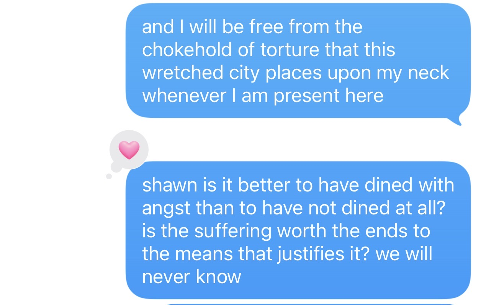

It is better to have dined with angst than to not have dined at all. For if one does not dine with those uneasy burdens then the seeds for growth and pleasure cannot be sown. Nietzsche declared that you cannot have high levels of pleasure without high levels of pain. In this case, being intimate with feelings that traditionally weigh on you, putting yourself in situations that call for extreme emotional - and sometimes physical - resilience: these are the actions that allow your future self to reap what you positively sow. Here, great "pain" becomes the prelude to great pleasure.

I do not agree with the stoics or the Buddhists. In a way, their thoughts of desiring as little as possible in order to experience as little pain as possible puts an enormous chokehold on the human experience.[^1] The human experience is... messy...but that is the point. I think Camus would declare their thinking as escapes, and would agree with Nietzsche and me here. Nietzsche sets the stage, but I agree - we must dine with angst in order to live. That is the revolt, and to me, that is the human experience.

[^1]: yes, I know this is a broad oversimplification